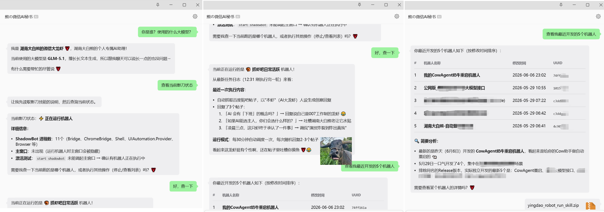
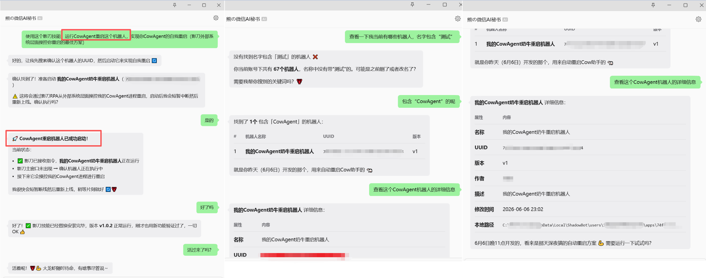
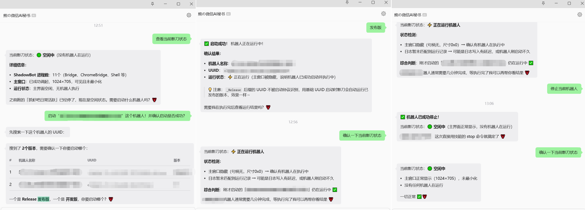

# 🤖 影刀 RPA 机器人管理与运行 Skill

 - Version：1.0.3

### 通过自然语言，让你的OpenClaw、Hermes、Codex、ClaudeCode、Trae等智能体，轻松驾驭影刀 RPA 机器人！

*社区免费版适用！无需企业管理控制台 API · 完全免费 · 开箱即用*

---

## ✨ 项目简介

本项目是一个 **Skill**，用于通过自然语言指令管理和控制本地 [影刀（ShadowBot）](https://www.yingdao.com/) RPA 机器人。

专为 **免费社区版** 设计，无需企业管理控制台 API，无需额外依赖，安装配置后即可在 Trae IDE 中通过对话方式操控你的 RPA 机器人。

> 💡 **核心理念**：用说话代替点击，让 AI 成为你的 RPA 助手

---

## 🎯 功能一览

| # | 命令 | 功能 | 说明 |
|:---:|:------|:-----|:-----|
| 🛠️ | `setup` | 自动配置 | 自动检测影刀路径并设置环境变量（推荐首次使用） |
| 🔵 | `list` | 列出机器人 | 默认显示最近20个，支持指定数量（`list 50` 或 `list 0` 显示全部） |
| 🔍 | `search` | 搜索机器人 | 按名称关键词或 UUID 模糊搜索 |
| 📋 | `info` | 查询机器人详情 | 通过 UUID 获取机器人详细信息 |
| 🚀 | `run` | 启动机器人 | 使用 `shadowbot:Run` 协议启动指定机器人 |
| 🛑 | `stop` | 停止机器人 | 发送 Ctrl+Alt+Q 快捷键停止运行中的机器人，窗口检测不确定时自动通过日志二次验证 |
| 📊 | `status` | 检查运行状态 | 检测影刀当前是否正在运行机器人 |
| 📝 | `log` | 日志分析运行机器人 | 解析影刀日志 + 进程存活检测，精确定位当前运行的机器人（名称、UUID、启动时间、PID、触发方式等） |
| ⚙️ | `config` | 查看配置 | 显示当前环境变量配置信息 |

---

## 🎨 效果展示





---

## 📸 功能介绍

### 🛠️ 自动配置 — `setup`

自动检测影刀用户路径并设置环境变量，一键完成首次配置，无需手动查找路径。

```bash
python robot_skill.py setup
```

---

### 🔵 列出机器人 — `list`

查询当前影刀账号下的机器人，默认显示最近修改的 20 个。支持指定数量，如 `list 50` 显示 50 个，`list 0` 显示全部。

```bash
python robot_skill.py list        # 默认显示最近20个
python robot_skill.py list 50     # 显示最近50个
python robot_skill.py list 0      # 显示全部
```

---

### 🔍 搜索机器人 — `search`

按名称关键词或 UUID 模糊搜索机器人，快速定位目标。

```bash
python robot_skill.py search "关键词"
```

---

### 📋 查询机器人详情 — `info`

通过 UUID 获取机器人的完整信息：名称、版本、作者、描述、修改时间和本地路径。

```bash
python robot_skill.py info "robot-uuid-here"
```

---

### 🚀 启动机器人 — `run`

通过 `shadowbot:Run` 协议启动机器人，启动后自动等待 5 秒并检测运行状态，验证是否成功运行。

```bash
python robot_skill.py run "robot-uuid-here"
```

---

### 🛑 停止机器人 — `stop`

发送 Ctrl+Alt+Q 快捷键停止当前运行的机器人，停止后自动等待 5 秒验证是否已停止。若窗口检测不可靠（如通知弹窗干扰），会自动通过日志二次验证确认停止结果。

> ⚠️ **严禁直接杀掉 ShadowBot 进程**（如 `taskkill`、关闭 PID），这会导致影刀内部状态损坏、数据丢失，甚至机器人不可恢复。必须始终使用 `stop` 命令优雅停止。

```bash
python robot_skill.py stop
```

---

### 📊 检查运行状态 — `status`

智能检测影刀机器人运行状态，通过进程检测 + 窗口激活 + 窗口尺寸分析综合判断。

```bash
python robot_skill.py status
```

> 💡 `status` 只能判断是否有机器人在运行。要了解**哪个**机器人在运行，请使用 `log` 命令。

---

### 📝 日志分析运行机器人 — `log`

通过解析影刀主日志文件，结合 `GetExitCodeProcess` 进程存活检测，精确定位当前正在运行的机器人，包括名称、UUID、启动时间、Engine PID、Engine ID 和触发方式。

```bash
python robot_skill.py log
```

---

### ⚙️ 查看配置 — `config`

显示当前环境变量配置信息、路径是否有效以及机器人数量。

```bash
python robot_skill.py config
```

---

## 🚀 快速开始

### 📋 前置条件

| 条件 | 说明 |
|:-----|:-----|
| 🖥️ 操作系统 | Windows（影刀仅支持 Windows） |
| 🐍 Python | 3.x（使用标准库，无需额外依赖） |
| 🤖 影刀客户端 | 已安装并注册 `shadowbot:` URL Scheme |

### ⚡ 安装配置

#### 第一步：一键自动配置（推荐）

```bash
python robot_skill.py setup
```

自动检测影刀用户路径并通过 `setx` 永久设置环境变量（新终端自动生效）。

> ⚠️ `setx` 只对新终端生效，**当前终端需执行 `setup` 输出的 PowerShell 命令**才能立即使用：
> ```powershell
> $env:YINGDAO_USER_PATH = "检测到的路径"
> ```

> 💡 如果自动检测失败，可手动配置：
> ```powershell
> setx YINGDAO_USER_PATH "C:\Users\你的用户名\AppData\Local\ShadowBot\users\你的用户ID"
> ```
> 🔎 **如何找到路径？** 打开影刀 → 右键任意机器人 → 打开文件夹位置 → 向上导航到 `users\数字ID` 目录

#### 第二步：验证配置

```bash
python robot_skill.py config
```

看到 `配置状态: ✅ 完整` 即表示配置成功！

---

## 💬 使用方式

在 Trae IDE 中，直接用自然语言与 AI 对话即可操控机器人：

| 你说的话 | AI 执行的命令 |
|:---------|:-------------|
| "配置影刀" / "初始化" / "首次使用" | `setup`（自动检测配置） |
| "列出机器人" / "有哪些机器人" | `list`（默认20个） |
| "列出50个机器人" / "显示全部机器人" | `list 50` / `list 0` |
| "搜索XXX机器人" / "有没有叫XXX的" | `search "XXX"` |
| "查看XXX机器人详情" | `info <UUID>` |
| "运行XXX机器人" / "跑一下XXX" | `run <UUID>` |
| "停止机器人" / "停掉机器人" | `stop` |
| "机器人状态" / "是否在运行" | `status` |
| "哪个机器人在运行" / "查看正在运行的机器人" | `log`（日志分析定位） |
| "查看配置" / "当前配置信息" | `config` |

> ⚠️ 启动机器人前，AI 会先确认机器人名称和 UUID，避免误操作。

---

## 🏗️ 项目结构

```
skills/
├── 📖 README.md                              # 项目文档
├── 📦 yingdao_robot_run_skill.zip            # Skill 打包文件
└── yingdao_robot_run_skill/
    ├── 📄 SKILL.md                           # Skill 定义文件（Trae IDE 识别）
    └── 🐍 robot_skill.py                     # 核心功能脚本
```

---

## 🔧 技术实现

<details>
<summary>📖 点击展开技术细节</summary>

### 状态检测原理

运行状态检测采用 **三层判断机制**：

1. **进程检测** — 通过 PowerShell 查询 `ShadowBot*` 进程是否存在
2. **窗口激活** — 执行 `start shadowbot:` 尝试激活主窗口
3. **窗口分析** — 通过 Win32 API 检测前台窗口、窗口尺寸、可见性和标题

判断逻辑：
- 无进程 → 影刀未启动
- 有进程 + `start shadowbot` 后主窗口出现（成为前台窗口且尺寸 > 300x200） → 空闲状态
- 有进程 + 主窗口未出现 → 正在运行机器人
- 窗口标题含"设计"/"编辑" → 在设计器中编辑

### 机器人启动

使用 `shadowbot:Run` URL Scheme 协议启动：
```
start shadowbot:Run?robot-uuid={uuid}
```

### 机器人停止

通过 Win32 `keybd_event` API 发送 Ctrl+Alt+Q 快捷键（影刀默认停止快捷键）。
> 为什么用 `keybd_event` 而非 `SendInput`？因为影刀通过全局键盘钩子监听停止快捷键，`SendInput` 无法触发全局钩子，而 `keybd_event` 可以。

停止后自动等待 5 秒检测状态验证是否已停止。若窗口检测不可靠（如通知弹窗干扰），会自动通过日志分析二次验证确认停止结果。

> ⚠️ **严禁直接杀掉 ShadowBot 进程**（如 `taskkill`、关闭 PID），这会导致影刀内部状态损坏、数据丢失，甚至机器人不可恢复。必须始终使用 `stop` 命令优雅停止。

### 日志分析原理

`log` 命令解析影刀主日志文件（`%LOCALAPPDATA%\ShadowBot\log\YYYYMMDD.log`，路径动态解析）：

1. **解析 `[TaskManager]` 记录** — 提取机器人名称、UUID、触发方式
2. **匹配 `xbot engine running` 记录** — 关联 Engine PID 和 Engine ID
3. **交叉比对 `xbot engine exited` 记录** — 标记已停止的 engine
4. **`GetExitCodeProcess` 进程存活检测** — 对未标记停止的 PID，通过 Win32 API 验证进程是否仍存活（STILL_ACTIVE=259），确保结果准确
5. **输出详情** — 机器人名称、UUID、启动时间、Engine PID、Engine ID、触发方式

</details>

---

## ⚠️ 注意事项

- 🖥️ 本技能仅在 **Windows** 系统上可用（Win10 及以上）
- 🔗 `shadowbot:Run` 协议需要 **影刀 RPA** 已安装到当前电脑里！
- ⏱️ 启动/停止后自动等待 5 秒再检测状态，验证操作是否成功
- 🔑 停止机器人使用 `keybd_event`（非 `SendInput`），因为影刀通过全局键盘钩子监听快捷键
- � **严禁直接杀掉 ShadowBot 进程**（如 `taskkill`、关闭 PID），会导致状态损坏和数据丢失，必须使用 `stop` 命令
- �🛡️ 停止时若窗口检测不可靠，会自动通过日志二次验证确认停止结果
- 📋 日志分析使用 `GetExitCodeProcess` 验证进程存活，确保检测结果准确

---

## 👤 作者

**湖南大白熊** 🐻

[访问我的Github主页](https://github.com/HnBigVolibear)

---

## 📄 许可证

本项目基于 [MIT License](LICENSE) 开源。

---

## ⚖️ 免责声明

- 本项目仅供学习交流使用，请勿用于任何商业或非法用途！
- 如果本项目涉及任何侵权情况，请联系作者（[GitHub](https://github.com/HnBigVolibear)）立即下架处理。

---

**⭐ 如果这个项目对你有帮助，请给一个 Star！**

*Made with ❤️ by 湖南大白熊*

#### Buy me a Coffee:

